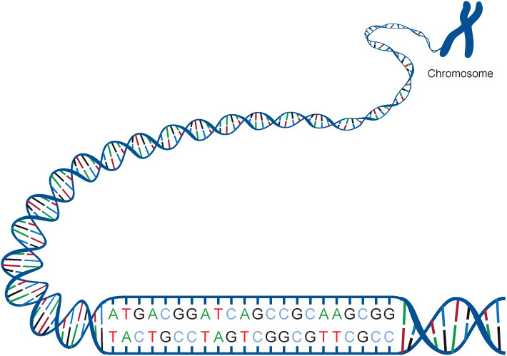
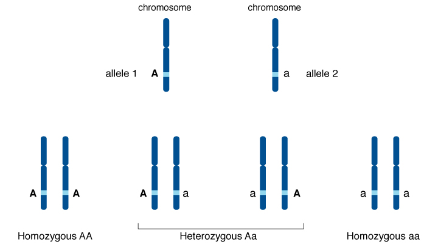

layout: true
---

## Plan
- Background and related work

---

## Background: Chromosome, DNA, ACTG, Amino Acid, BP

---

## Background: Cell, Protein

---

## Background: Genome

---

## Background: Mutation ~ Variant, SNP

---

## Background: Allele, Genotype / Phenotype

---

## Background: Cancer

---

## Background: Genomics
- TODO

---

## What is Big Data?

---

## Related work

---

## Problem definition
- The most popular human genomic data analysis tool is plink (Harvard University)
- Large volume of data is slowing down the DNA variant discovery process
  - Some analysis task takes up to a few days to compute the results
- Most promising recent technology (ADAM) uses Big Data techniques

---

## Main research question
- How can the performance of genomic analysis be improved?

---

## Sub question
- What are the most problematic plink use cases today ?
- What is the technological bottleneck ?
- How can this be improved ?

---

## Objective of this research
- Propose a scalable genomic analytics framework, named (mango?), compatible with the ADAM format (Berkeley University)
- Identify the missing data structures in ADAM format to allow plink scalability;
- Identify the Big Data techniques that are required to improve the scalability of plink;

---

## Originality of the work
- Use recent Big Data technologies to solve Genomics Analysis Performance Problems
- TODO: diagram showing Adam and the other software it replaces

---

## Methodology - Planning (Basili Framework)

???

- **SURVEY** designed for bioinformaticians and geneticians to assess the most important features of plink software that slows down their DNA analysis process and their quality criteria for the adoption of a software replacement to plink.
- **PROBLEM**: Which analysis have poor scalability + What are the use expectations in ACCURACY & USABILITY from the users.
- **TECHNIQUES** includes data structures required to improve the scalability of plink software and end-user satisfaction 

---

## Methodology - Experimentation
- TODO: add a drawing of the experiment with Dr. Hamet
- Tools used:
  - Apache Spark: Processing engine (Spark is the most active Big Data technology of 2014).
  - MLlib: machine learning library
  - ADAM: Genomics Formats
  - Avocado: DNA Variant Calling
  - Scala: programming language
  - Docker: infrastructure
  - Parquet/Avro: file format

---

## Methodology - Analysis Techniques

- Measuring before (plink 1.07 and plink 1.9) and after (MANGO):
  - **Scalability**
    - Platform = Amazon AWS (cloud computing)
    - Dataset = 5 open source genomes from the 1000 Genomes Project
    - Nb of runs = 5 runs on each dataset.
    - Nb of records = TODO T.B.D. (+ annotations ?)
    - Tool = to record duration? TODO T.B.D.
    - Job Turnaround time (ISO 25010) or _wall clock time_ ([Wikipedia](http://en.wikipedia.org/wiki/Wall-clock_time)): duration as perceived by the user
    - Total CPU execution time (ISO 25010): cumulative duration of all nodes
    - Speedup (Amdahl's law), (Karp-Flatt metric), (Gustafson's law)
      - For distributed system, the effective speedup is (CITATION NEEDED)
        - `S(N) = T(N) / T(1)` where `T`: Turnaround Time, and `N`: NB of worker nodes
  
  - **Functional correctness (_accuracy_)** (ISO 25010)
    - We'll compare plink 1.9 and MANGO's results against results from plink 1.07
    - NOTE: the assesment method will be precised once the genomic analysis to be optimized has been selected
    - TODO: How do we validate the accuracy? With a genetician?
    - Quality characteristics to evaluate (QUINT-2):
      - **Failure ratio**: *the ratio of incorrect processed transactions to the total of presented transactions*
      - **Significant digit ratio**: *the ratio of the implemented significant digits to the required significant digits.*
 
  - **Usability**
    - **Compatibility** (ISO 25010) with file formats (VCF, ADAM, etc.)
    - **Interoperability** (ISO 25010) of MANGO with plink
    - **Expert judgement on operability** (ISO 25010) Is MANGO's command line easy to use, as judged by experts in the field (bioinformaticians). We'll send a satisfaction survey to the bioinformaticians involved in the 2 case studies.

---

## Expected results

---

## Preliminary results
- VariantMiner
- Cloud infrastructure pour les outils de berkeley

---

## Schedule

- (*2014 Fall*) DGA1005
- (*2015 Winter*) DGA1031
- (*2015 Summer*)
  - DGA1032
  - Survey
  - Identification of required scaling techniques 
- (*2015 Fall*) 
  - DGA1033
  - Case study 1
- (*2016 Winter*) MANGO prototype 1
- (*2016 Summer*) Case study 2
- (*2016 Fall*) 
  - MANGO prototype 2
  - Dissertation
- (*2017 Winter*) Dissertation
- (*2017 Summer*) Dissertation
- (*2017 Fall*) DGA1095 Defense

---

## References

- [Amdahl's Law](http://en.wikipedia.org/wiki/Amdahl's_law)
  - `S(T) = 1 / (alpha + (1-alpha)/T )`  where
    - `S(T)` : theoretical maximum speedup;
    - `alpha` : fraction of the algorithm that is strictly serial;
    - and `T` : nb of threads
- [Karp-Flatt Metric](http://en.wikipedia.org/wiki/Karp–Flatt_metric)
- [Gustafson's Law](http://en.wikipedia.org/wiki/Gustafson%27s_law)
  - `S(P) = P - alpha(P-1)` where
    - `S(P)` : theoretical maximum speedup
    - `P` : nb of processors
- [Quint 2: The Extended ISO Model of Software Quality](http://foswiki.cs.uu.nl/foswiki/pub/Swa/CourseLiterature/QUINT2.pdf)
- [ISO 9126 & ISO 25010](http://en.wikipedia.org/wiki/ISO/IEC_9126)

(for each topic)

## Appendix A: Relevant quality attributes from Quint-2 (temporary notes)

  - 1. Functionality
    - 1.2 **Accuracy** (renamed to "functional correctness" in ISO 25010)
      - Are the MANGO results as accurate as with the original plink?
      - (the evaluation will depends on the selected genomic analysis)
      - 1.2.1 **Failure ratio**: *the ratio of incorrect processed transactions to the total of presented transactions*
      - 1.2.2 **Significant digit ratio**: *the ratio of the implemented significant digits to the required significant digits.*
    - 1.3 **Interoperability** with VCF, ADAM and other plink formats => moved to compatibility
      - 1.3.2 **Matched data format ratio**: *the ratio of data formats matched to those of the other system in the interoperation*
      - 1.3.4 **Matched interface ratio**: *the ratio of interfaces matched to those of the other systems in interoperation*
    - 1.6 **Traceability**
      - *Ease of verifying correctness of data processing on required points*
  - 3. **Usability**
    - 3.2 **Learnability**: *Availability of help functions* integrated on the command line client (plink does not have inline help for all features)
    - 3.3 **Operability**: *Users' effort for operation and operation control*
      - 3.3.1 **Expert judgement on operability**: *The extent to which the software products presents functionality to the user without hindrance, as judget by a team of experts in this field.*
    - 3.4 **Explicitness**: *Clarity of the software product's status (progression bars, etc.).*
  - 4. **Performance Efficiency**:
    - 4.1 **Time behavior**
      - 4.1.4 **Processing capacity**: *Number of processing tasks of a certain type that the user can perform during a certain period with a certain usage load.* (e.g. executing the same analysis with varying parameters in parallel)
      - 4.1.7 **Turnaround time**: *Indicates the speed of processing by measuring the elapsed time between the beginning of process requirement and gaining the result of the process.*.
      - 4.1.10 **CPU execution time**
    - 4.2 **Resource behavior**: need to record RAM,CPU,DISK,NETWORK usage over time as a secondary comparison measure

## Appendix B: Quality attributes from ISO 25010 (temporary notes)

#### **Quality in use model**
- 4.1.1 **Effectiveness**: *accuracy and completeness with which users achieve specified goals*
- 4.1.3.1 **Satisfaction > usefulness**: *degree to which a user is satisfied with their perceived achievement of pragmatic goals, including the results of use*

#### **Product quality model**
- 4.2.1.2 **Functional suitability > Functional correctness**: *Degree to which a product or system provides the corrects results with the needed degree of precision*
- 4.2.2.1 **Performance efficiency > Time behaviour**: *Degree to which the response and processing times and throughput rates of a product or system, when performing its functions, meet requirements*
- 4.2.3.2 **Compatibility > Interoperability**: *Degree to which two or more systems, products or components can exchange information and use the information that has been exchanged*
- 4.2.4 **Usability**: *Degree to which a product or system can be used by specified users to achieve specified goals with effectiveness, efficiency and satisfaction in a specified context of use*

## TODO (temporary notes)
Survey 1:
- identify the minimal set of features for the adoption of a novel analytic software. There will be import/export feature to/from plink and VCF. But since the scope of plink is too large, users will still need to use 2 software for some time. So what is the minimal set of feature required so that users are willing to use 2 software instead of 1 (even if slower).
